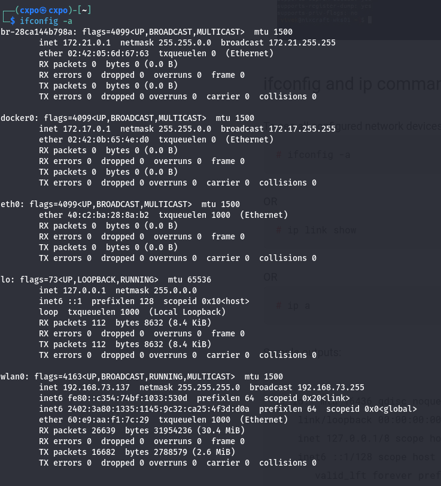
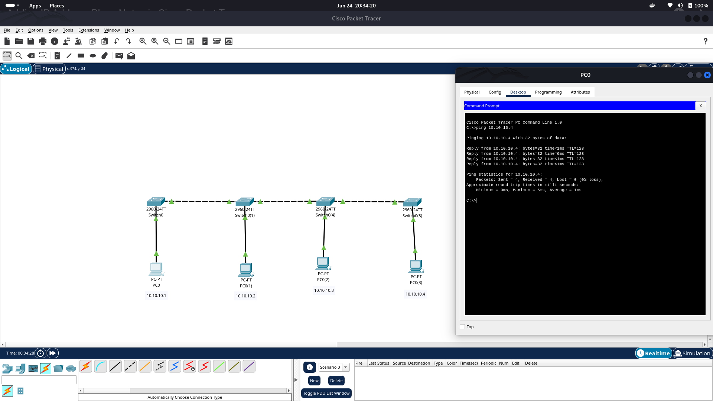

# Computer Networking
## 1) Basics of terminal
### List network interfaces 
- To list interfaces, I found three commands i.e. `ifconfig`, `ip address` and `nmcli`
- Output of above commands :\

### Assign Static IP (Using `ip` command)
- To assign static IP and subnet mask

- To change default gateway\

- To change DNS to Cloudflare DNS. (Cannot be done by `ip`)

- Result of DNS change\

### Ping a remote server
- Data sent over internet is divided into small segments called packets.
- Sometimes, packets fail to reach their destination called packet loss.

- Min, Max, Avg and Mean deviation of round trip time and are shown in above image

### Traceroute
- During transmission of data over internet, it is supposed to cross multiple networks called hop to hop transfer.
- Three stars mean that `traceroute` cannot get IP of routers due to overload and security reasons.

## 2) Basic Network Topology Module
- I used Cisco Packet Tracer for simulation.
- Simulation files (`.pkt`) are also uploaded.
### Star
- In star topology, multiple end devices are connected to single switch.

### Bus
- In this topology, end devices are connected to switch and switches are connected together in a line.

### Ring
- In this topology, end devices are connected to switch and switches are connected in ring manner.

