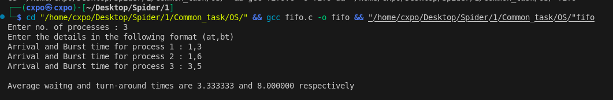
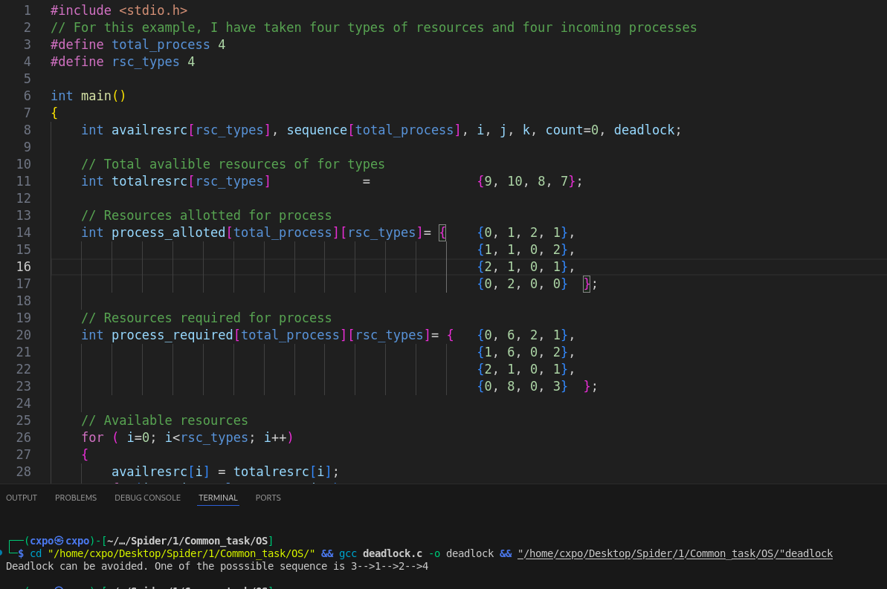

# OS

## 1) Process Management
- __Waiting Time__ : Time spent by ready state process before execution for resource allotment.
- __Turn Around Time__ : Total time taken by process from arrival to completion including waiting time.
### FIFO Script Usage
- Example is given in follwing image\

## 2) Deadlock Handling
- This script is based on Banker Algorithm
- It predicts whether deadlock occurs or not. If not, prints the one of the possible sequence of process.
-  For this script, I have taken four types of resources and four incoming processes.
- You can change resouces matrix and number of processes and resources.\

