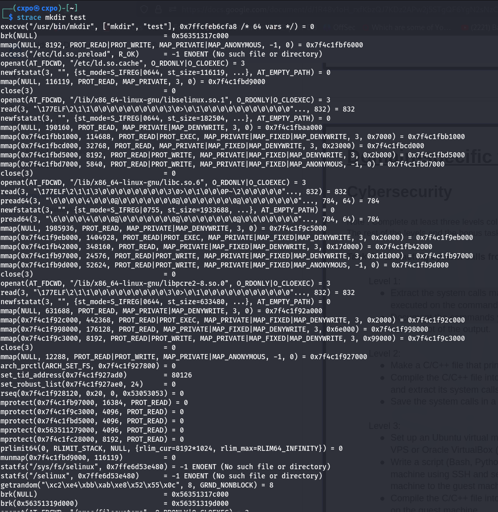
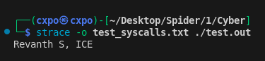
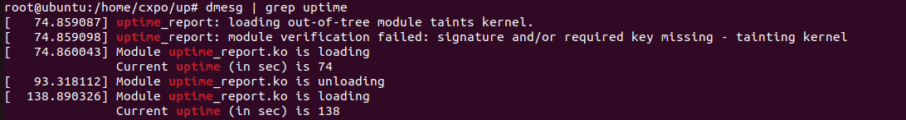

# CyberSecurity
- I have done all three levels in Task A and bonus task of linux kernel module.
## Task A
### Level 1
- System calls of `mkdir` is extracted by `strace`

### Level 2
- C file is compiled and system calls are extracted.
- Files are available in [c_syscalls](./c_syscalls/)\

### Level 3
- Files are available in [remote_syscalls](./remote_syscalls/)
- Demo :

https://github.com/realityrevanth/spider_1/assets/88923943/1e767464-ba27-4d9f-bbc7-cb8d3a376ea4

## Bonus Task (Linux Kernel Module Development)
- `uptime_report.ko` and files required for building are available in [kernel_uptime_mod](./kernel_uptime_mod/)
- Screenshots : 

