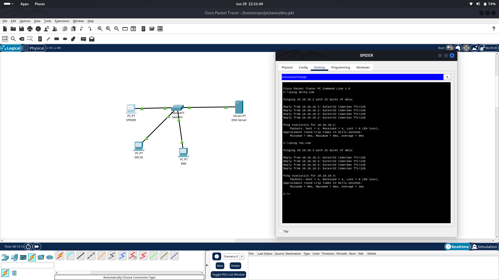
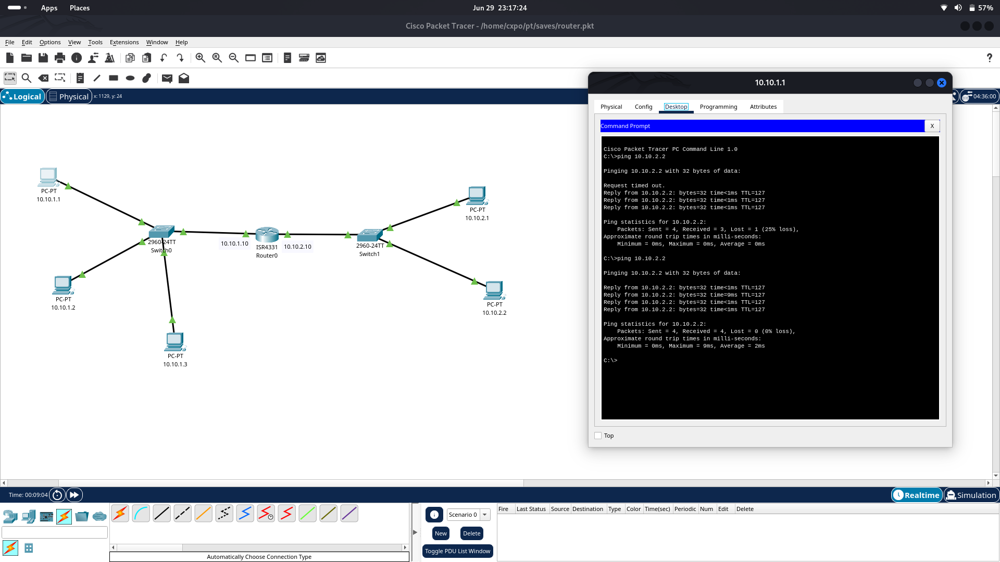
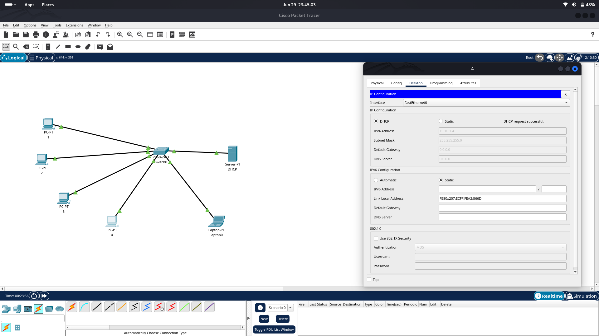
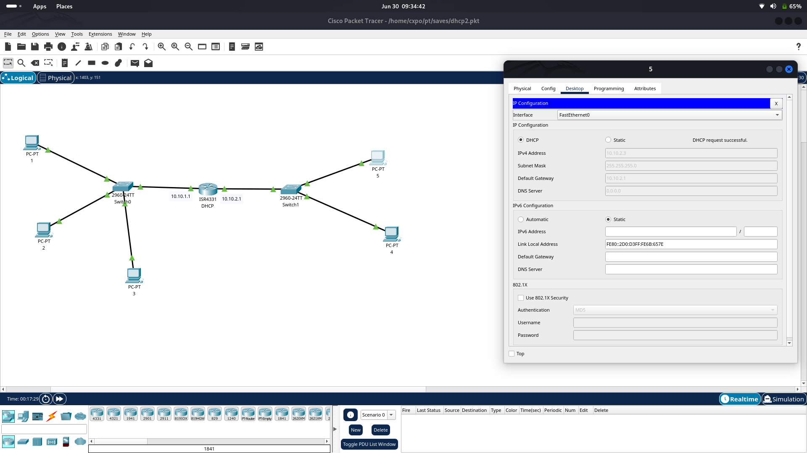

# Computer Networking
## 1) DNS Server Mapping Module
- DNS stands for Domain Name System.
- Resolution of address into IP is done by DNS.
- DNS servers are of 4 types i.e. recursive server, rootname server, TopLevelDomain(TLD) server and authoriative name server.
- DNS efficiency can be calculated by DNS lookup time.
- Screenshot : 

## 2) Routing Module
- Router is used to route connections between different networks.
- Each router interface has specific IP which is default gateway for end devices connected in the network.
- Screenshot : 

- First packet is lost due to ARP(Address Resolution Protocol)

## 3) DHCP Module
- DHCP (Dynamic Host Configuration Protocol) assigns IP and other realted things like gateway, subnet mask, dns, etc. to end devices.
- DHCP has many options like Starting IP, Excluded and Reserved IP, Lease, Gateway, DNS server etc. 
- __Starting and Ending IP__ : Specifies range of IP to be allocated to end devices.
- __Excluded and Reserved IP__ : IP which is either alloted to specific user or not alloted.
- __Lease Time__ :  Duration for which a DHCP server assigns an IP address to a device.
### DHCP using dedicated server

### DHCP using router

